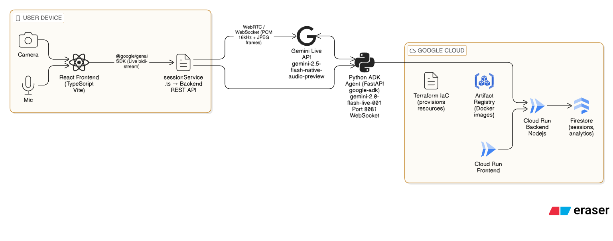

# EyeFriend

[](LICENSE)
[](https://www.python.org)
[](https://fastapi.tiangolo.com)
[](https://react.dev)
[](https://www.typescriptlang.org)

## Overview

EyeFriend is a real-time accessibility assistant that continuously analyzes a device's camera feed and speaks aloud what it sees, hazards, obstacles, text, and scene descriptions, so that visually impaired users can navigate the world with greater confidence. The assistant listens and responds to voice commands, proactively issues safety alerts, and can generate tactile-style overhead maps of the environment on demand, all without requiring the user to touch the screen.

The interface is built around a high-contrast **black and yellow color scheme**, which is the [internationally recognized standard for accessibility signage](https://www.rnib.org.uk/living-with-sight-loss/assistive-aids-and-technology/high-contrast-colour-schemes/) for people with low vision. Studies from the Royal National Institute of Blind People confirm that black text or icons on a yellow background, and vice versa, produce the highest perceptible contrast ratio, reducing eye strain and maximizing legibility in a wide range of lighting conditions.

All interface text uses **Helvetica Neue**, a grotesque sans-serif typeface consistently ranked among the most legible typefaces for people with low vision. Its even stroke width, open apertures, and absence of decorative serifs make individual characters easier to distinguish, as detailed in [this accessibility typography research](https://www.ncbi.nlm.nih.gov/pmc/articles/PMC8461370/). The interface is fully responsive and adapts to mobile portrait layouts so the app is practical to hold in one hand while navigating in real life. Because the frontend is a standard Progressive Web App served over HTTPS, it can be embedded or linked from any platform,a native app shell, a kiosk, a browser extension, or a third-party service, without additional packaging.

Quick experimentation without a local setup is possible directly in [Google AI Studio](https://aistudio.google.com) by importing the project at [EyeFriend AI Studio Project](https://ai.studio/apps/6682225f-d62e-4b7a-9f79-db42f806a1d0) and supplying a `GEMINI_API_KEY`.

## Architecture



The user's browser captures camera frames at 4 FPS and PCM microphone audio at 16 kHz. Both streams are forwarded over a bidirectional WebSocket to the Gemini Live API via the `@google/genai` SDK. Gemini responds with 24 kHz PCM audio that is played back in real time, and with structured tool calls (`proactive_alert`, `update_scene_summary`, `generate_tactile_map`) that drive UI state. Session lifecycle events, session start/end, alert counts, text-read counts, are persisted to Cloud Firestore through the Node.js REST backend running on Cloud Run. An optional Python agent built with Google ADK provides an alternative server-side streaming path on port 8081, also backed by Firestore.

## Technologies

The frontend is a single-page application written in **React 19** and **TypeScript 5**, bundled with **Vite 6**. Live audio and video streaming to Gemini is handled by the official [`@google/genai`](https://www.npmjs.com/package/@google/genai) JavaScript SDK (`v1.40.0`), which wraps the Gemini Live WebSocket protocol. The primary model used for real-time inference is `gemini-2.5-flash-native-audio-preview-12-2025`, which natively processes interleaved audio and video without additional transcoding. Overhead tactile maps are generated on demand with `gemini-2.0-flash-preview-image-generation`. UI animations are powered by [Motion](https://motion.dev), and icons are provided by [Lucide React](https://lucide.dev).

The REST backend is a lightweight **Express.js** service running on **Node.js 20**. It exposes session CRUD endpoints and an analytics aggregate endpoint, all persisted to **Cloud Firestore** using the [`@google-cloud/firestore`](https://www.npmjs.com/package/@google-cloud/firestore) client, which authenticates automatically via Application Default Credentials on Cloud Run. The optional Python-based **Google ADK agent** ([`google-adk >= 1.0.0`](https://pypi.org/project/google-adk/)) runs as a **FastAPI + Uvicorn** WebSocket server and provides a server-side streaming alternative using `gemini-2.0-flash-live-001`. Cloud infrastructure is provisioned declaratively with **Terraform**, deploying Cloud Run services for both frontend and backend, creating a Firestore native-mode database, and managing an Artifact Registry Docker repository with a dedicated service account scoped to Firestore read/write.

### Google Cloud API calls: examples from the codebase

**Firestore session creation** ([`backend/server.js`](backend/server.js)):
```js
// POST /api/sessions called by services/sessionService.ts on connect
const docRef = await db.collection('sessions').add({
  mode,
  status: 'active',
  startedAt: new Date(),
  alertsCount: 0,
  textReadCount: 0,
});
```

**Gemini Live bidi-stream** ([`App.tsx`](App.tsx)):
```ts
const session = await ai.live.connect({
  model: 'gemini-2.5-flash-native-audio-preview-12-2025',
  config: {
    responseModalities: [Modality.AUDIO],
    speechConfig: { voiceConfig: { prebuiltVoiceConfig: { voiceName: 'Charon' } } },
    tools: [{ functionDeclarations: [proactiveAlertDecl, sceneUpdateDecl, tactileMapDecl] }],
    systemInstruction: { parts: [{ text: SYSTEM_PROMPT }] },
  },
  callbacks: { onmessage, onclose, onerror },
});
```

**ADK agent streaming** ([`agent/agent.py`](agent/agent.py)):
```python
from google.adk.agents import LlmAgent
from google.adk.runners import Runner
from google.adk.sessions import InMemorySessionService

agent = LlmAgent(
    model="gemini-2.0-flash-live-001",
    name="eyefriend_agent",
    instruction=SYSTEM_PROMPT,
    tools=[proactive_alert, update_scene_summary, generate_tactile_map],
)
runner = Runner(agent=agent, session_service=InMemorySessionService(), app_name="eyefriend")
```
## Automated Cloud Deployment

All Google Cloud infrastructure is provisioned with **Terraform** and deployed end-to-end by a single shell script, no manual console clicks required.

### What Terraform provisions ([`terraform/`](terraform/))

| Resource | File | Purpose |
|---|---|---|
| `google_project_service` × 4 | `main.tf` | Enables Cloud Run, Firestore, Cloud Build, Artifact Registry APIs |
| `google_firestore_database` | `main.tf` | Native-mode Firestore database in the target region |
| `google_artifact_registry_repository` | `main.tf` | Docker registry for all service images |
| `google_service_account` + IAM binding | `main.tf` | Dedicated SA for the backend with `roles/datastore.user` |
| `google_cloud_run_v2_service` (backend) | `main.tf` | Node.js REST API, 0-3 instances, 512 MB, public |
| `google_cloud_run_v2_service` (frontend) | `main.tf` | React SPA, 0-2 instances, 256 MB, public |

**Key Terraform resources** ([`terraform/main.tf`](terraform/main.tf)):

```hcl
# Firestore native-mode database
resource "google_firestore_database" "main" {
  name        = "(default)"
  location_id = var.region
  type        = "FIRESTORE_NATIVE"
}

# Dedicated service account — Firestore read/write only
resource "google_service_account" "backend" {
  account_id   = "eyefriend-backend"
  display_name = "EyeFriend Backend"
}

resource "google_project_iam_member" "backend_firestore" {
  project = var.project_id
  role    = "roles/datastore.user"
  member  = "serviceAccount:${google_service_account.backend.email}"
}

# Backend Cloud Run service — auto-scales to zero when idle
resource "google_cloud_run_v2_service" "backend" {
  name     = "eyefriend-backend"
  location = var.region

  template {
    service_account = google_service_account.backend.email
    containers {
      image = "${local.registry}/backend:${var.image_tag}"
      env { name = "GOOGLE_CLOUD_PROJECT" value = var.project_id }
      env { name = "ALLOWED_ORIGIN"       value = "https://${var.frontend_domain}" }
      resources { limits = { cpu = "1", memory = "512Mi" } }
    }
    scaling { min_instance_count = 0  max_instance_count = 3 }
  }
}

# Frontend Cloud Run service — receives backend URL as env var at deploy time
resource "google_cloud_run_v2_service" "frontend" {
  name     = "eyefriend-frontend"
  location = var.region

  template {
    containers {
      image = "${local.registry}/frontend:${var.image_tag}"
      env { name = "VITE_BACKEND_URL" value = google_cloud_run_v2_service.backend.uri }
      resources { limits = { cpu = "1", memory = "256Mi" } }
    }
    scaling { min_instance_count = 0  max_instance_count = 2 }
  }
}
```

**Terraform outputs** ([`terraform/outputs.tf`](terraform/outputs.tf)):

```hcl
output "backend_url"  { value = google_cloud_run_v2_service.backend.uri }
output "frontend_url" { value = google_cloud_run_v2_service.frontend.uri }
output "registry"     { value = local.registry }
```

### One-command deployment ([`deploy.sh`](deploy.sh))

`deploy.sh` runs four steps in sequence with no manual intervention:

```bash
# Step 1. Аuthenticate Docker with Artifact Registry
gcloud auth configure-docker "${REGION}-docker.pkg.dev" --quiet

# Step 2. Enable GCP APIs (idempotent)
gcloud services enable run.googleapis.com firestore.googleapis.com \
  artifactregistry.googleapis.com cloudbuild.googleapis.com \
  --project="${PROJECT_ID}" --quiet

# Step 3. Build & push Docker images (tag = git SHA)
docker build -t "${REGISTRY}/backend:${IMAGE_TAG}"  ./backend
docker push "${REGISTRY}/backend:${IMAGE_TAG}"

docker build --build-arg GEMINI_API_KEY="${GEMINI_API_KEY}" \
             --build-arg VITE_BACKEND_URL="__BACKEND_URL_PLACEHOLDER__" \
             -t "${REGISTRY}/frontend:${IMAGE_TAG}" .
docker push "${REGISTRY}/frontend:${IMAGE_TAG}"

# Step 4. Terraform apply (state stored in GCS bucket)
cd terraform
terraform init -backend-config="bucket=${PROJECT_ID}-tfstate"
terraform apply -auto-approve \
  -var="project_id=${PROJECT_ID}" \
  -var="region=${REGION}" \
  -var="image_tag=${IMAGE_TAG}"
```

Usage:

```bash
export GOOGLE_CLOUD_PROJECT=your-project-id
export GEMINI_API_KEY=your-gemini-key
bash deploy.sh
```

## Project Structure

```
eyefriend/
├── App.tsx                        # Main React component (Gemini Live integration)
├── index.tsx                      # React DOM entry point
├── index.css                      # Global styles (black/yellow palette, Helvetica)
├── index.html                     # HTML shell
├── types.ts                       # Shared TypeScript types (Alert, SessionStatus…)
├── vite.config.ts                 # Vite config (dev server, env vars, path aliases)
├── tsconfig.json                  # TypeScript compiler config
├── package.json                   # Frontend dependencies
├── metadata.json                  # App metadata (camera + microphone permissions)
│
├── backend/                       # Node.js REST API
│   ├── server.js                  # Express server (sessions & analytics endpoints)
│   ├── package.json               # express, @google-cloud/firestore, cors
│   ├── Dockerfile                 # Multi-stage Node.js 20 build
│   └── .env.example               # GOOGLE_CLOUD_PROJECT, ALLOWED_ORIGIN, PORT
│
├── agent/                         # Python ADK agent (alternative streaming path)
│   ├── agent.py                   # FastAPI + google-adk bidi-streaming agent
│   ├── requirements.txt           # google-adk, fastapi, uvicorn, firestore, websockets
│   ├── Dockerfile                 # Python 3.11 runtime
│   └── .env.example               # GEMINI_API_KEY, GOOGLE_CLOUD_PROJECT
│
├── services/                      # Frontend service layer
│   ├── sessionService.ts          # Firestore REST calls via backend
│   └── audioService.ts            # PCM encode/decode utilities
│
├── terraform/                     # Infrastructure as Code (GCP)
│   ├── main.tf                    # Cloud Run, Firestore, Artifact Registry, IAM
│   ├── variables.tf               # project_id, region, image_tag, frontend_domain
│   ├── outputs.tf                 # backend_url, frontend_url, registry
│   └── terraform.tfvars.example   # Variable values template
│
├── docker-compose.yml             # Local development stack (frontend + backend)
├── Dockerfile                     # Frontend multi-stage production build
└── deploy.sh                      # One-shot GCP deployment script
```

## How to Run

There are three ways to run EyeFriend. Pick the one that fits your situation.

### Option A: Manual local setup (development)

**Requirements:** Node.js 20+, Python 3.11+

**1. Clone the repository**

```bash
git clone https://github.com/<your-org>/eyefriend.git
cd eyefriend
```

**2. Configure environment variables**

```bash
# Frontend
echo "GEMINI_API_KEY=your_gemini_api_key" > .env
echo "VITE_BACKEND_URL=http://localhost:8080" >> .env

# Backend
cp backend/.env.example backend/.env
# Edit backend/.env:
#   GOOGLE_CLOUD_PROJECT=your-gcp-project-id
#   ALLOWED_ORIGIN=http://localhost:3000

# Agent (optional)
cp agent/.env.example agent/.env
#   GEMINI_API_KEY=your_gemini_api_key
#   GOOGLE_CLOUD_PROJECT=your-gcp-project-id   ← leave blank for in-memory fallback
```

**3. Start the backend**

```bash
cd backend && npm install && node server.js
# REST API running at http://localhost:8080
```

**4. Start the Python ADK agent (optional)**

```bash
cd agent && pip install -r requirements.txt
uvicorn agent:app --host 0.0.0.0 --port 8081
# WebSocket agent running at ws://localhost:8081
```

**5. Start the frontend**

```bash
npm install && npm run dev
# Vite dev server running at http://localhost:3000
```

Open [http://localhost:3000](http://localhost:3000) in Chrome, grant camera and microphone permissions, and press **Start**.

---

### Option B: Docker Compose (local, one command)

**Requirements:** Docker

```bash
GEMINI_API_KEY=your_key \
GOOGLE_CLOUD_PROJECT=your-project \
docker compose up --build
```

Frontend at [http://localhost:3000](http://localhost:3000), backend at [http://localhost:8080](http://localhost:8080).

---

### Option C: Deploy to Google Cloud

**Requirements:** `gcloud` CLI (authenticated), Docker, Terraform

```bash
export GOOGLE_CLOUD_PROJECT=your-project-id
export GEMINI_API_KEY=your_gemini_api_key
bash deploy.sh
# Prints the live Cloud Run URLs when done
```

See the [Automated Cloud Deployment](#automated-cloud-deployment) section for details on what this script provisions.